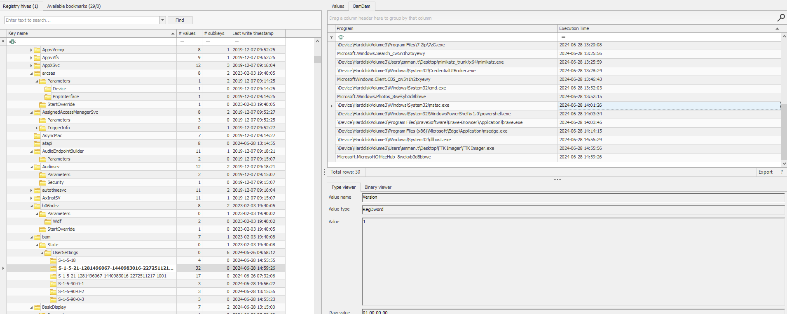

## 1. When was the last failed logon attempt using emman.t user? (UTC)
- Because all logs are erased by attacker, then try to extract logon activities on SAM hive
- Open SAM hive with Register Explorer and find the following key
```bash
\ROOT\SAM\Domains\Account\Users
```
- On ***Last Incorrect Password*** field, this is the last time that user login fail.
**Ans: 2024-06-26 07:24:35**
## 2. What are the first 3 IP addresses that emman.t connected to using Remote Desktop (RDP)?
- Explore NTUSER.dat hive on emman.t user folder, open it with Registry Explorer
- Search for ***Terminal Server Client*** key, which is used for saving data about RDP session
**Ans:192.168.86.250,192.168.25.128,192.168.25.131**
## 3. What is the destination username used to remote desktop to for the first time on 2024-06-20 16:01:05 UTC?
- In same key, find the username corresponds to the time
**Ans: tommyxiaomi**
## 4. What is the destination IP address of the last Remote Desktop (RDP) session?
- In same key, get time of the last RDP session
**Ans: 192.168.70.133**
## 5. emman.t is very careless in always saving RDP credentials to connect to other hosts, so we believe that attacker somehow leaked them. Please confirm credentials of the server with ip 192.168.70.133 that was leaked?
- Normally, saved RDP creds will be encrypt with user masterkey, we need to find user's master key first
- User masterkey is saved on ***C:\Users\user_name\AppData\Roaming\Microsoft\Protect\<SUID>\<GUID>***. We can use mimikatz like the way how attacker do in logs
```bash
mimikatz.exe "dpapi::masterkey /in:\"C:\Users\emman.t\AppData\Roaming\Microsoft\Protect\S-1-5-21-1281496067-1440983016-2272511217-1000\<GUID>\" /password:emman2024"
```
- After having all masterkey, we can extract save rdp creds on ***C:\Users\user_name\AppData\Local\Microsoft\Credentials\<filename>***
```bash
 mimikatz.exe "dpapi::cred /in:"C:\Users\a\Desktop\latus\Users\emman.t\AppData\Local\Microsoft\Credentials\E80F5D2B48E15FBDF9878791495BF295" /masterkey:54c80986172f586f32e6f3e3ffe9901ddbe3f0d39d186adb7dd287ff3ff8614addf2f3ef1ce1f95a28f8115c463b93e2481e2a56a68678be9a0572867ec0976c" exit"
```
- There is some successful decryption, also fail case, because of many masterkey and a lot of Credentails file, I wrote a script to automatically find all masterkey of a user, then use it to extract all rdp creds. Masterkey will be saved on **masterkey.txt** and log for decrypted blob is saved on **rdp_creds_success.log**
```bash
python saved_rdpcreds_dump_by_dpapi.py -t "C:\Users\a\Desktop\latus\Users\emman.t" -p "emman2024"
```
> -t: target directory to recursively search
> -p: password to decrypt user's masterkey
- scrutinize **rdp_creds_success.log** file, we will see log for creds on IP 192.168.70.133
```bash
Decrypting Credential:
 * masterkey     : 5902689a5601048b83a7858a842c20d79abff55d82c6d1a35148cc97533760b212d2354057fe3bbdb4d8fdf0ea6fdd1aa79d8bef0101136ebad6ce0eb73e93e8
**CREDENTIAL**
  credFlags      : 00000030 - 48
  credSize       : 000000da - 218
  credUnk0       : 00000000 - 0

  Type           : 00000002 - 2 - domain_password
  Flags          : 00000000 - 0
  LastWritten    : 6/26/2024 8:26:49 AM
  unkFlagsOrSize : 00000018 - 24
  Persist        : 00000002 - 2 - local_machine
  AttributeCount : 00000000 - 0
  unk0           : 00000000 - 0
  unk1           : 00000000 - 0
  TargetName     : Domain:target=TERMSRV/192.168.70.133
  UnkData        : (null)
  Comment        : (null)
  TargetAlias    : (null)
  UserName       : HQ-DOM-03\Administrator
  CredentialBlob : C@mv@0s3rv3r
  Attributes     : 0
```

**Ans: C@mv@0s3rv3r**
## 6. When was the last time the Remote Desktop Connection application was executed? (UTC)
- Find mstsc.exe (Microsoft terminal service) on prefetch after being parsed by pecmd, get last run time.
**Ans: 2024-06-28 13:56:48**
## 7. When was the last time the Remote Desktop Connection application was terminated? (UTC)
- I don't even understand why it works like that, but anyway, find bam (background activity moderator) in SYSTEM hive, under emmant.t's SID, we will find time execution of mstsc.exe.
(The ***Execution Time*** field updates at both process start and process termination. It represents the most recent time the process state changed, either started or stopped.)
```bash
\SYSTEM\CurrentControlSet\Services\bam\State\UserSettings\{SID}
```

**Ans: 2024-06-28 14:01:26**

## 8. How long did the penultimate RDP session last?
- I dont even understand why the result need to be, it's just a trick. I found a RDP bitmap modified as well as Default.rdp extended, this mean it represents for the end of penultimate RDP session (because the last session ends at 11:51:03, it's also containing rdp bitmap modified). Extract $LogFile by [LogFileParser](https://github.com/jschicht/LogFileParser), in the output directory, find the file **Logfile_lfUsnJrnl.csv**, it contains metadata about file changed of NTFS.
```bash
Cache0000.bin|393658464|2024-06-28 13:40:21.6065986|FILE_DELETE+CLOSE|34674|9|105943|4|archive+not_content_indexed|2|0|0x00000000|0
Cache0000.bin|393658552|2024-06-28 13:40:21.6074726|FILE_CREATE|383|6|105943|4|archive+not_content_indexed|2|0|0x00000000|0
Cache0000.bin|393658640|2024-06-28 13:40:21.6074726|FILE_CREATE+DATA_EXTEND|383|6|105943|4|archive+not_content_indexed|2|0|0x00000000|0
Cache0000.bin|393658728|2024-06-28 13:40:21.7034274|FILE_CREATE+DATA_EXTEND+CLOSE|383|6|105943|4|archive+not_content_indexed|2|0|0x00000000|0
Default.rdp|393658816|2024-06-28 13:40:21.7970588|DATA_TRUNCATION|105892|4|101172|2|hidden+archive|2|0|0x00000000|0
Default.rdp|393658904|2024-06-28 13:40:21.7970588|DATA_TRUNCATION+DATA_EXTEND|105892|4|101172|2|hidden+archive|2|0|0x00000000|0
Default.rdp|393658992|2024-06-28 13:40:21.8133378|DATA_TRUNCATION+DATA_EXTEND+CLOSE|105892|4|101172|2|hidden+archive|2|0|0x00000000|0
```
```bash
Cache0001.bin|393743888|2024-06-28 13:51:02.8184895|FILE_DELETE+CLOSE|65538|4|105943|4|archive+not_content_indexed|2|0|0x00000000|0
Cache0001.bin|393743976|2024-06-28 13:51:02.8184895|FILE_CREATE|28077|12|105943|4|archive+not_content_indexed|2|0|0x00000000|0
Cache0001.bin|393744064|2024-06-28 13:51:02.8184895|FILE_CREATE+DATA_EXTEND|28077|12|105943|4|archive+not_content_indexed|2|0|0x00000000|0
Cache0001.bin|393744152|2024-06-28 13:51:02.9074169|FILE_CREATE+DATA_EXTEND+CLOSE|28077|12|105943|4|archive+not_content_indexed|2|0|0x00000000|0
Default.rdp|393744240|2024-06-28 13:51:03.0783071|DATA_TRUNCATION|105892|4|101172|2|hidden+archive|2|0|0x00000000|0
Default.rdp|393744384|2024-06-28 13:51:03.0783071|DATA_TRUNCATION+DATA_EXTEND|105892|4|101172|2|hidden+archive|2|0|0x00000000|0
Default.rdp|393744472|2024-06-28 13:51:03.0783071|DATA_TRUNCATION+DATA_EXTEND+CLOSE|105892|4|101172|2|hidden+archive|2|0|0x00000000|0
```
- from then, I can be sure that end time of penultimate RDP session is 2024-06-28 13:40:21. but I need to find when this session starts, I try to list the mstsc.exe prefetch file execution time, but all of execution time is not correct. Then an idea coming to me, attacker run mimikatz to extract rdp saved credentials, so rdp session have to be between the time mimikatz execution and disconnecting time.
  + last mimikatz execution: 2024-06-28 13:20:17
  + end penultimate rdp session: 2024-06-28 13:40:21
- The duration is 20 minutes and 6 seconds, then I try to bruteforce time by decreasing time from 00:20:06 to 0, and I got 11:42
**Ans: 00:11:42**
## 9. When did the attacker disconnect the last Remote Desktop (RDP) session? (UTC)
- The Default.rdp file is a configuration file automatically created and updated by the Remote Desktop Client (mstsc.exe) whenever you connect to a remote machine using RDP. It typically stores the settings of the last session and is modified whenever an RDP session is initiated or disconnected.
- Key Observations:
  + Modified Time (2024-06-28 13:51:03 UTC): This indicates the time when the attacker terminated their RDP session. At this point, Default.rdp was updated to save session details (e.g., screen resolution, connection parameters, etc.).
  + Last mstsc.exe execution Time (2024-06-28 13:56:48 UTC): This indicates that the Remote Desktop Client (mstsc.exe) was executed again after the disconnection. However, it does not mean a new connection was established—it could simply mean the application was opened.
- Then the time attacker disconnect last RDP session is 2024-06-28 13:51:03 (Also, there is a rdp bitmap modified at 13:51:03, this should indicate that rdp session has ended and bitmap was updated after disconnecting)
**Ans: 2024-06-28 13:51:03**
## 10. What is the size of the remote desktop configured?
- Find the Default.rdp file, this is used for saving config of RDP 
**Ans: 1920:1080**
## 11. What tool did attacker use to discover the network after moving laterally to 192.168.70.133?
- Because all logs are deleted, I try to parse RDP cache to find something smelthy (Users/emman.t/AppData/Local/Microsoft/Terminal Server Client/Cache/cache).
- Install and parse cache by [bmc-tools](https://github.com/ANSSI-FR/bmc-tools)
```bash
git clone https://github.com/ANSSI-FR/bmc-tools.git
python3 bmc-tools/bmc-tools.py -s cache/Cache0001.bin -d output2
```
- There are 3 file caches, then I parse it into 3 dir named ***output_num***, then use [RdpCacheStitcher](https://github.com/BSI-Bund/RdpCacheStitcher/tree/main) to load images. After a few minutes, I found some powershell images corresponding tool for network discovery

**Ans: NetBScanner**
## 12. When was the event log deleted by the attacker? (UTC)
- Search event id 1102 on SECURTY log.
**Ans: 2024-06-28 14:03:25**
## 13. What time did attacker disconnect session to 192.168.70.129? (UTC)
- Filter eventid 24 (session has been disconnected) on **Microsoft-Windows-TerminalServices-LocalSessionManager/Operational**
```bash
Remote Desktop Services: Session has been disconnected:

User: HQ-DOM-03\emman.t
Session ID: 1
Source Network Address: 192.168.70.9
```
**Ans: 2024-06-28 14:03:53**

